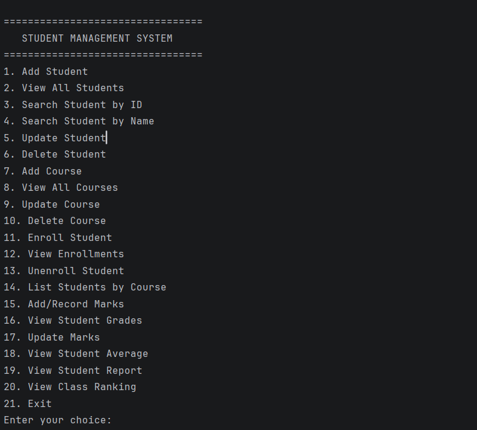
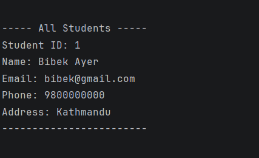
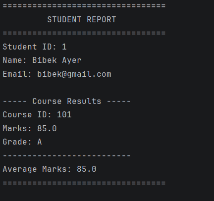

# Student Management System

## Project Description

Student Management System is a console-based Java application developed to manage student records, courses, enrollments, and academic performance. The application uses Object-Oriented Programming, Java Collections, JDBC, and MySQL to provide persistent data storage and a simple menu-driven interface.

The system allows users to add, view, update, delete, and search students and courses, manage course enrollments, record grades, calculate average marks, generate student reports, and display class rankings.

---

## Features Implemented

### Student Management

- Add student records
- View all students
- Search students by ID
- Search students by name
- Update student information
- Delete student records

### Course Management

- Add courses
- View all courses
- Search courses by ID
- Update course information
- Delete courses

### Enrollment Management

- Enroll students in courses
- View all enrollments
- View enrollments by student
- List students enrolled in a course
- Unenroll students from courses

### Grade Management

- Add marks for students
- View all grades
- Search grade by ID
- Update grades
- View grades by student
- View grades by course
- Calculate student average marks
- Convert marks into grades

### Reports

- Generate individual student reports
- Display course results
- Display marks and grades
- Calculate average marks
- Generate class ranking based on average marks

---

## Technologies and Libraries Used

- **Java:** JDK 11+
- **Database:** MySQL
- **Database Connectivity:** JDBC
- **JDBC Driver:** MySQL Connector/J
- **IDE:** IntelliJ IDEA
- **Version Control:** Git
- **Repository:** GitHub

---

## Java Concepts Used

The project demonstrates the following Java concepts:

### Object-Oriented Programming

- Encapsulation
- Inheritance
- Abstraction
- Polymorphism

### Collections Framework

The project uses:

- `ArrayList`
- `List`
- `HashMap`
- `Map`

Collections are used for storing, processing, filtering, and sorting student and grade data.

### Exception Handling

The project includes:

- `StudentNotFoundException`
- `CourseNotFoundException`
- `DatabaseException`

SQL exceptions are handled through the database access layer.

### JDBC

JDBC is used to connect the Java application with MySQL and perform database operations.

The application supports:

- INSERT
- SELECT
- UPDATE
- DELETE

Prepared statements are used for database queries.

---

## Project Structure

```text
StudentManagementSystem
|
|-- src
|   |
|   |-- model
|   |   |-- Person.java
|   |   |-- Student.java
|   |   |-- Course.java
|   |   |-- Enrollment.java
|   |   `-- Grade.java
|   |
|   |-- dao
|   |   |-- StudentDAO.java
|   |   |-- StudentDAOImpl.java
|   |   |-- CourseDAO.java
|   |   |-- CourseDAOImpl.java
|   |   |-- EnrollmentDAO.java
|   |   |-- EnrollmentDAOImpl.java
|   |   |-- GradeDAO.java
|   |   `-- GradeDAOImpl.java
|   |
|   |-- service
|   |   |-- StudentService.java
|   |   |-- CourseService.java
|   |   |-- EnrollmentService.java
|   |   |-- GradeService.java
|   |   `-- ReportService.java
|   |
|   |-- exception
|   |   |-- StudentNotFoundException.java
|   |   |-- CourseNotFoundException.java
|   |   `-- DatabaseException.java
|   |
|   |-- util
|   |   `-- DBConnection.java
|   |
|   `-- Main.java
|
|-- schema.sql
|-- config.properties
|-- .gitignore
`-- README.md
```

---

## Database Design

The application uses MySQL for persistent data storage.

### Database Name

```text
student_management
```

### Tables

The database contains four main tables:

```text
students
courses
enrollments
grades
```

### Students Table

Stores:

- Student ID
- Student name
- Email
- Phone
- Address

### Courses Table

Stores:

- Course ID
- Course code
- Course name

### Enrollments Table

Stores the relationship between students and courses.

### Grades Table

Stores:

- Grade ID
- Student ID
- Course ID
- Marks

---

## Database Setup

### 1. Install MySQL

Install:

- MySQL Server
- MySQL Workbench

### 2. Create the Database

Open MySQL Workbench.

Open the `schema.sql` file included in this project and execute it.

The SQL script creates the following database:

```text
student_management
```

and the required tables:

```text
students
courses
enrollments
grades
```

---

## Database Configuration

Create a file named:

```text
config.properties
```

in the project root.

Use the following format:

```text
db.url=jdbc:mysql://localhost:3306/student_management
db.user=root
db.password=YOUR_MYSQL_PASSWORD
```

Replace `YOUR_MYSQL_PASSWORD` with your local MySQL password.

The actual database password should not be committed to GitHub.

The `config.properties` file is excluded using `.gitignore`.

---

## MySQL Connector/J Setup

The project requires the MySQL Connector/J JDBC driver.

Add the MySQL Connector/J `.jar` file to the IntelliJ IDEA project classpath.

The JDBC driver allows the Java application to communicate with the MySQL database.

---

## How to Run the Project

### Requirements

Before running the project, install:

- JDK 11 or newer
- MySQL Server
- MySQL Workbench
- IntelliJ IDEA
- MySQL Connector/J
- Git

### Step 1: Clone the Repository

Clone the GitHub repository:

```text
git clone YOUR_GITHUB_REPOSITORY_URL
```

Open the project in IntelliJ IDEA.

### Step 2: Setup the Database

Open MySQL Workbench.

Run the SQL commands from:

```text
schema.sql
```

### Step 3: Configure the Database

Create:

```text
config.properties
```

in the project root.

Enter your MySQL username and password.

### Step 4: Add MySQL Connector/J

Add the MySQL Connector/J JAR file to the project classpath.

### Step 5: Run the Application

Open:

```text
src/Main.java
```

Run the main method.

The application will start in the terminal and display the main menu.

---

## Console Interface

The application provides a menu-driven console interface.

The main functionality includes:

```text
Student Management
Course Management
Enrollment Management
Grade Management
Student Report
Class Ranking
Exit
```

Users select an option by entering the corresponding menu number.

---

## Student Report

The student report displays information such as:

- Student ID
- Student name
- Email
- Course ID
- Marks
- Grade
- Average marks

The report is generated using data retrieved from the MySQL database.

---

## Class Ranking

The class ranking feature calculates the average marks of students.

Students are then sorted according to their calculated average marks and displayed in the console.

The ranking uses Java Collections, including `Map` and `List`, together with sorting and iteration.

---

## Data Persistence

Student, course, enrollment, and grade information is stored in the MySQL database.

Therefore, data remains available after the application is closed and restarted.

---

## Exception Handling

The project uses custom exceptions to handle application-specific errors.

### StudentNotFoundException

Used when a requested student cannot be found.

### CourseNotFoundException

Used when a requested course cannot be found.

### DatabaseException

Used to handle database-related errors.

SQL exceptions are caught and converted into meaningful application-level database errors.

---

## Screenshots

The following screenshots demonstrate the console application running.

### Screenshot 1 - Main Menu

Add a screenshot of the application main menu here.

```text

```

### Screenshot 2 - Student Management

Add a screenshot showing student operations here.

```text

```

### Screenshot 3 - Student Report / Class Ranking

Add a screenshot showing the student report or class ranking here.

```text

```

---

## Known Limitations

The current version is a console-based application and does not include a graphical user interface.

The optional stretch goals from the assignment, such as attendance tracking, report export, and admin/student login modes, are not included because they are optional features.

The application is focused on the required Student Management System functionality.

---

## Git and GitHub

Git is used for version control throughout the development of the project.

The project is stored in a public GitHub repository.

The repository contains:

- Java source code
- Database schema
- README documentation
- Git history showing incremental development

Database credentials are excluded from the repository using `.gitignore`.

---

## Author

**Bibek Ayer**

Student Management System

Java + JDBC + MySQL